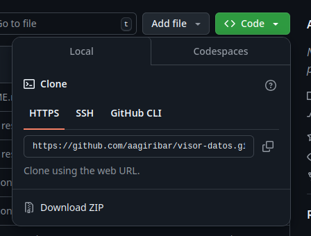
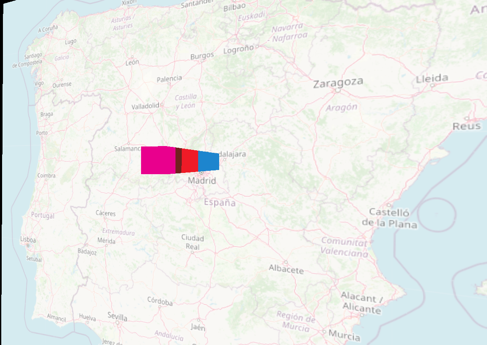

# Visor de resultados electorales
## Agustín Alfonso González Iríbar

Visualización de resultados de las elecciones al Congreso de los Diputados de España por provincias realizada con _three.js_.

## Acceso a la version web

La version web de este proyecto se encuentra en [este proyecto de glitch.com](https://visor-datos-agustin.glitch.me)

## Ejecución del proyecto en local

A continuación, se detallan las instrucciones de ejecución del proyecto de forma local en caso de que la version web fallara.

1. Descargar o clonar el repositorio



2. Descargar e instalar la version mas reciente de ``Node.js`` desde [este enlace](https://nodejs.org/en)

3. Para asegurar que la instalación se realizó correctamente utilizar los siguientes comandos en un terminal o símbolo del sistema:

```
node --version
npm --version
```

4. Una vez correctamente instalado ejecutar el siguiente comando desde un terminal o símbolo del sistema en el directorio o carpeta en el que se encuentre el proyecto:

```
npm install
```

5. Una vez termine el comando anterior ejecutar el siguiente comando desde el mismo terminal o simbolo del sístema:

```
npm run start
```

6. Una vez ejecutado este comando se observará en la consola algo parecido a esto:
```
> visor-datos-agustin@1.0.0 start
> node server.js

Your app is listening on port 3000
```

7. Abrir un navegador y, en la barra de direcciones, escribir ```localhost:3000``` sustituyendo el 3000 por el número indicado anteriormente.

8. Para terminar la simulación, pulsar la combinación de botones ```Ctrl + C``` en la consola donde se realizó el paso 5

## Datos

Los datos utilizados se encuentran en el directorio **data** organizados de la siguiente manera:

### Datos geográficos

En el fichero `datos_geo.csv` se encuentran almacenadas los datos geográficos de todas las provincias de España (latitud y longitud)

```
Provincia;Latitud;Longitud
Albacete;38.9941;-1.8584
Alicante/Alacant;38.34731;-0.49902
Almería;36.83800;-2.46059
Araba/Álava;42.85306;-2.69405
```

### Datos electorales

En el directorio `data/resultados` se encuentra un fichero `csv` por cada una de las eleccionas que se encuentran visualizadas.

```
Provincia;PP;PSOE;VOX;SUMAR;ERC;JxCAT-JUNTS;EH Bildu;EAJ-PNV;B.N.G.;CCa;U.P.N.
Almería;3;2;1;0;0;0;0;0;0;0;0
Cádiz;4;3;1;1;0;0;0;0;0;0;0
Córdoba;2;2;1;1;0;0;0;0;0;0;0
Granada;3;2;1;1;0;0;0;0;0;0;0
```

### Datos de colores

En el directorio `data/colores` se encuentra un fichero `csv` por cada una de las elecciones visualizadas en el que se encuentran los colores de cada partido para poder incluirlo en la visualización.

```
Partido;Color
PP;0x1d85ce
PSOE;0xef1b27
VOX;0x62bf20
SUMAR;0xef4b90
```

## Controles de la simulación

La cámara se puede controlar con el ratón. Para mover la cámara basta con clicar y arrastrar y se puede hacer zoom con la rueda del ratón.

La simulación incluye un panel de control con diferentes opciones explicadas a continuación.


### Selector de mapa

El selector denominado __Mapa seleccionado__ permite cambiar sobre que mapa orbita la cámara (`España` o `Canarias`).

Este selector solo está disponible cuando se visualizan los resultados de todas las provincias.

### Selector de proceso electoral

El selector denominado __Elección seleccionada__ permite seleccionar el proceso electoral a visualizar. En las opciones aparace el mes y el año de cada proceso electoral que se puede visualizar.

### Selector de provincia

El selector denominado __Provincia__ permite seleccionar la provincia sobre la que se quieren visualizar datos. Al seleccionar una provincia se eliminarán del mapa todos los datos que no correspondan a esa provincia. Además, la cámara pasará a orbitar alrededor de los datos de la provincia seleccionada.



Para volver a visualizar el resto de provincias basta con seleccionar la opción `Todas`.


## Visualización de resultados

En la parte superior izquierda de la pantalla se pueden visualizar el número de escaños de cada partido.

Al seleccionar todas las provincias, se visualizarán los resultados a nivel nacional.


Al seleccionar una provincia se pueden visualizar los resultados por partido en esa provincia.


## Referencias
Los resultados electorales han sido sacados de la [Web de Información Electoral del Ministerio del Interior](https://infoelectoral.interior.gob.es/es/inicio/).
